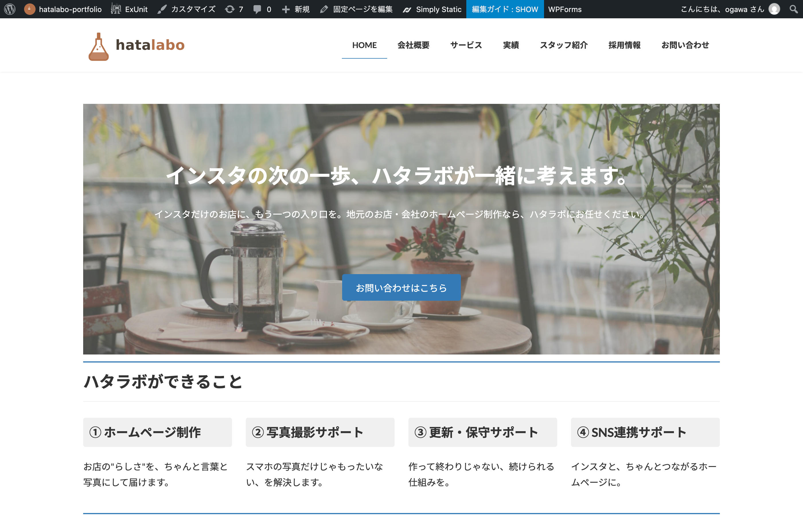
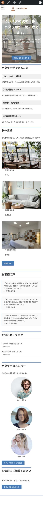

# hatalabo-portfolio

地元のお店・企業向けWebサイト制作会社「ハタラボ」の、架空案件を想定したコーポレートサイトです。
ポートフォリオ用に制作したデモサイトのため、登場する会社名・店舗名・スタッフは全て架空のものです。

## 🔗 公開URL

[https://coda-webcraft.github.io/hatalabo-portfolio/](https://coda-webcraft.github.io/hatalabo-portfolio/)

## 画面イメージ

| PC | スマホ |
|---|---|
|  |  |
| PC | スマホ |
|---|---|
|  |  |

## 📝 このサイトについて

「インスタだけでは伝えきれない魅力を、もう一つの入口で届ける」というコンセプトのもと、
地元の個人店・中小企業をクライアントに想定したコーポレートサイトです。

- 会社概要・サービス紹介・制作実績・スタッフ紹介・採用情報・お問い合わせの全7ページ構成
- テラコッタブラウン×セージグリーンの、あたたかみと親しみやすさを意識した配色
- 導入から成果まで、実在の制作会社を意識したストーリー性のある構成

## 🛠 制作環境

- WordPress(Lightningテーマ + 子テーマ / VK Blocks)
- お問い合わせフォーム:WPForms
- ローカル開発環境:Local by Flywheel

## 💡 制作でこだわったポイント

- **導線設計**:トップページから各ページへ迷わずたどり着けるよう、ナビゲーションと導線を整理
- **一貫性のあるデザイン**:配色・フォント・余白のルールを統一し、どのページを見ても同じブランドの一部だと感じられるように配慮
- **保守のしやすさ**:全ページで共通するヘッダー・フッターを一つの部品として管理する構成にし、後からの更新や修正がしやすい形に整理
- **公開方法の工夫**:WordPress上で作成したサイトを静的なファイルに変換し、誰でも閲覧できる形でポートフォリオとして公開

## 📂 ディレクトリ構成(抜粋)

```
hatalabo-portfolio/
├── index.php                  … トップページ
├── header.php / footer.php    … 全ページ共通のヘッダー・フッター
├── company-profile/           … 会社概要
├── service/                   … サービス紹介
├── achievements/               … 制作実績
├── staff-introduction/        … スタッフ紹介
├── recruitment-information/   … 採用情報
└── inquiry/                    … お問い合わせ
```

## ⚠️ 注意事項

お問い合わせフォームは静的サイトの仕組み上、見た目の再現のみとなっており、実際の送信機能はございません。
本番でのご利用の際は、WordPressでの運用またはフォーム送信機能のあるサーバーへの設置を想定しています。

## 👤 制作者

coda. — Web制作
